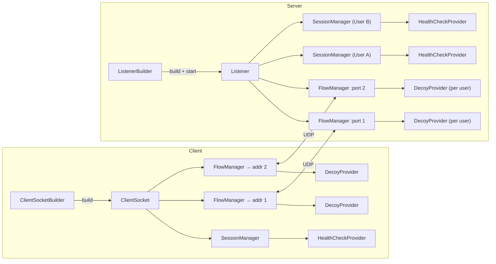
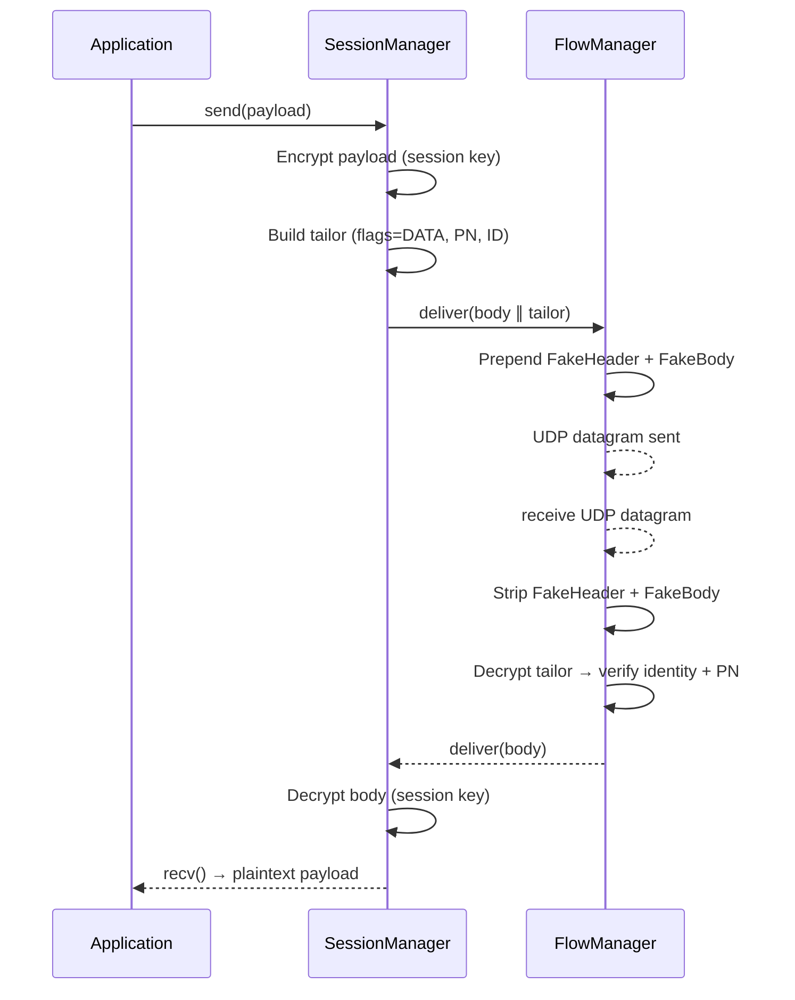
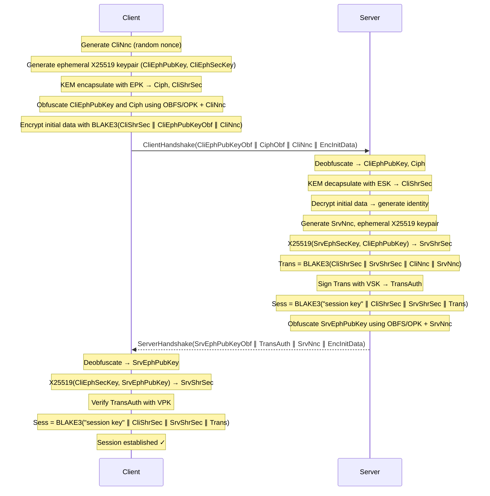
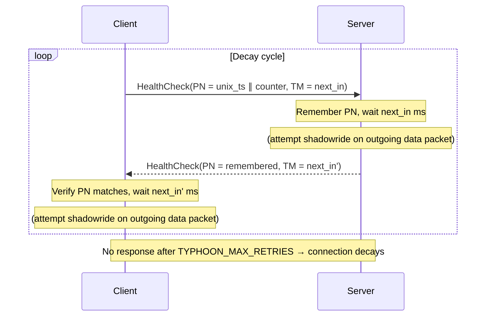
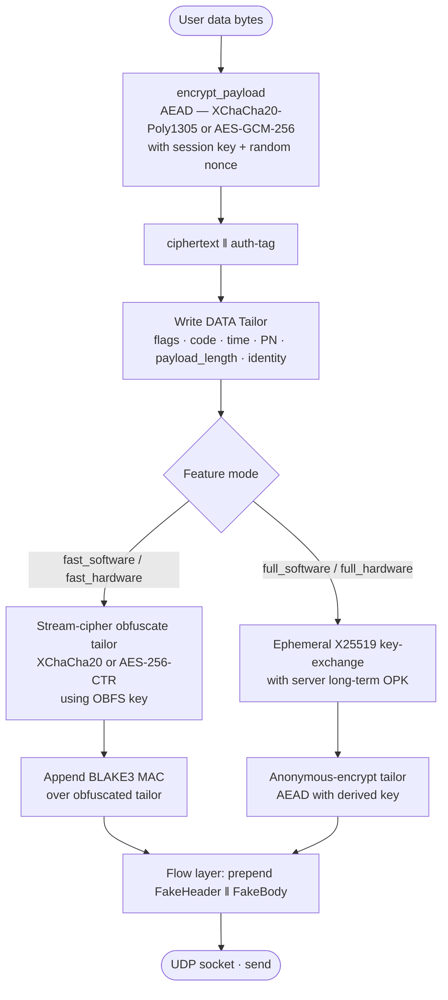
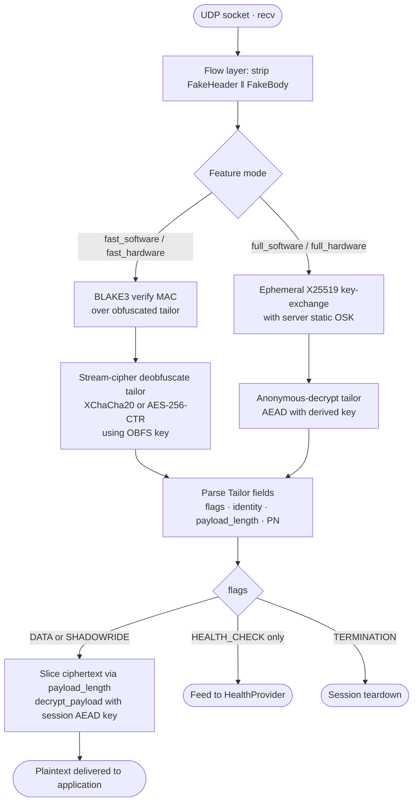

# TYPHOON Protocol Specification

This document describes TYPHOON protocol design, goals and proposed implementation in rust.

## Assumptions and limitations

There is one important assumption, required for proceeding with this protocol.
Making any message exchange undetectable requires continuous effort, meaning that all identifiable patterns must be eliminated.
The patterns in question include not only cleartext fields, but also encrypted fields with a well-known structure (i.e., fields that can be fingerprinted), messages sent at regular time intervals, messages of the same length, etc.

That is why it was decided to base the protocol on UDP, since it operates on raw network packets and does not require any packet size control.
Also, no certificate exchange handshake is proposed, because it would be impossible to encrypt completely, so a certificate should be pre-shared with all the users in advance via any third channels.

The protocol tries to mimic _generic protocol behavior_, which is common across most open-source protocols.
It does not target any specific protocol, because it could be too hard to imitate it statistically precisely.
If imitating a specific protocol is required, encrypted data should be embedded right into the protocol body (which is very possible for QUIC, DNS queries, etc.).

Finally, flow control and reliable data delivery are not goals of this protocol — they should be implemented by user applications.
Still, the protocol partly facilitates this goal by providing a health checking mechanism, so that a connection won't go down silently.

## Architecture



Every TYPHOON server or client consists of two separate parts: a session manager and a flow manager.
The session manager is responsible for maintaining the protocol state, encryption, and health checks — but it does not own any physical resources.
The flow manager is responsible for packet datagram flow obfuscation — one flow manager owns one UDP port.

In the simplest case (one client, one server), the flow manager is tightly coupled with the session manager on both client and server sides.
In a more complex scenario, a server can use several "proxy" flow managers, each having a separate port or IP address, or even being deployed on a separate device.
In that case, a client can select any number of these "proxies" to use and create a separate flow manager to contact each of them.
While it is technically possible for client flow managers to operate using different IP addresses as well, the practicality of this in the real world remains questionable.

## Packet structure

```text
 ◄──────────────── wire packet (left = start) ───────────────────►

 ┌───────────────┬───────────────┬───────────────────┬─────────────┐
 │   Fake Body   │  Fake Header  │ Encrypted Payload │  Encrypted  │
 │   see below   │   see below   │ (data/hs packets) │   Tailor    │
 │  (optional)   │  (optional)   │    variable len   │  fixed len  │
 └───────────────┴───────────────┴───────────────────┴─────────────┘
```

There are two types of packets in the TYPHOON protocol: real packets and decoy packets.
Real packets contain a payload and a header; they are either processed or generated (in the case of health check packets) by the session manager.
The payload is encrypted with [marshalling encryption](#marshalling-encryption) using a session key.
The header is appended _after_ the payload, so hereinafter it will be called the "tailor" instead.
Its structure will be explained [below](#tailor-structure), and it is encrypted with [tailor encryption](#tailor-encryption).
The decoy packets, in turn, are just random bytes.

After a real packet body is constructed, it is passed to the flow manager.
Decoy packets are generated by the flow manager itself and are inserted right away.
The flow manager treats all the packets similarly: it prepends them with a [fake header](#fake-header) structure and a [fake body](#fake-body).
See more about this in [proposed implementation](#insertion-and-processing) chapter.

Fake header and fake body structures are selected either randomly upon flow manager initialization (default) or manually.

### Tailor structure

The tailor should always be positioned _at the very end_ of a TYPHOON packet.
The tailor structure consists of the following fields (total: `16 + TYPHOON_ID_LENGTH` bytes):

```text
 Byte offset →   0    1    2         5    6              13   14   15   16 …
                 ┌────┬────┬────────────┬────────────────┬────────┬──────────┐
                 │ FG │ CD │  TM (4 B)  │   PN (8 B)     │ PL(2B) │ ID (N B) │
                 │flag│code│  next_in   │packet number   │pay.len │identity  │
                 └────┴────┴────────────┴────────────────┴────────┴──────────┘
```

| Field code | Field name | Byte length | Production meaning | Debug meaning |
| --- | --- | --- | --- | --- |
| **FG** | flags | `1` | Flags defining packet contents | - |
| **CD** | code | `1` | Client type in client handshake, handshake result in server handshake | Packet unique reference number |
| **TM** | time | `4` | Delay before the next health check packet (milliseconds), unused for other packets | Packet sending timestamp |
| **PN** | packet number | `8` | Combined packet number | - |
| **PL** | payload length | `2` | Length of encrypted packet payload | - |
| **ID** | identity | constant | Client [version](#version-checking) in client handshake, client identification number afterwards | - |

> The **ID** field length is controlled by `TYPHOON_ID_LENGTH` constant and specifies the maximum number of simultaneous connections.
> See [implementation advices](#sockets-and-listeners) for more information on client attribution.

See [debug mode description](#debug-mode) for more information on protocol debugging and how the header is interpreted differently in debug mode.
Packet flags can have the following values:

- `128`: handshake packet.
- `64`: health check packet.
- `32`: data packet.
- `16`: decoy packet.
- `8`: termination packet.

> Normally only one of these values should be set, but there is an exception: a health check packet (that normally has an empty body) can be embedded into a data packet, that situation hereinafter is called "shadowride".

The tailor is the only part of the message that should be decrypted by the flow manager.
It always starts at `packet_length - tailor_length - tailor_encryption_overhead` and ends at the end of the packet.
If the data flag is set, the payload should be read starting from `packet_length - tailor_length - tailor_encryption_overhead - payload_length` and until the start of the tailor.
If the decoy flag is set, the packet should be discarded right away by the flow manager.

### Fake body

Fake body is just a random-length string of random bytes.
It can be either empty, random or constant:

- `empty`: body is always empty, `0` bytes length.
- `random`: body length is random, it is bound between `TYPHOON_FAKE_BODY_LENGTH_MIN` and `TYPHOON_FAKE_BODY_LENGTH_MAX` constant values, making all the packets different in size.
- `service`: same as `random`, but is only applied to [health check](#health-check-packets) and [handshake](#handshake-packets) packets.
- `constant`: body length depends on the lengths of the other packet parts and complement them to a constant size.

> Handling `constant` body length might not be trivial, as it imposes a strict limit on packet data contents length.
> TYPHOON protocol specifically does not support data fragmentation, so `constant` body length just won't have any effect if real packet body length is not always strictly limited.

By default, fake body mode is chosen with equal probability for every option except for `service`, which is `TYPHOON_FAKE_BODY_SERVICE_PROBABILITY` heavier than the others.

### Fake header

Fake header is a special structure that mimics a header of some protocol sent in cleartext.

The header itself consists of a few fields, each field is either `1`, `2`, `4` or `8` bytes long (all primitive integer lengths), their total length in bytes is bound between `TYPHOON_FAKE_HEADER_LENGTH_MIN` and `TYPHOON_FAKE_HEADER_LENGTH_MAX` constants.
Each of these fields can be one of these types: random, constant, volatile, switching or incremental:

- `random`: fields have random values in every packet.
- `constant`: fields always have the same value (within a session).
- `volatile`: fields change their value with random time intervals.
- `switching`: fields change their value with set and predictable time intervals.
- `incremental`: fields add `1` to their value in every packet.

By default, fake header is enabled with `TYPHOON_FAKE_HEADER_PROBABILITY` probability.
All the fake header field modes are chosen with equal probability.

## Packet behavior

In general, the packet behavior is defined not only by packet type (explained below), but also by the source that the packet originates from.
The decoy packets are generated by the flow manager, and so they are sent directly as they are.
All the other packets are generated by the session manager - and so they should be delivered to one of the flow managers.

On the client side, the flow manager selection is weighted random.
Upon connection startup, a set of server proxies is selected and a flow manager with a random weight is created for every one of them.
During packet delivery, a random flow manager picks up the packet, where randomness is regulated by its weight.

On the server side, everything is a little more complex.
The server keeps a set of clients mapped to their unique identifiers (**ID** tailor field), but it is never notified about client proxy selection.
Each server flow manager independently tracks the last known source address per client: whenever it receives a correctly-authenticated packet from a client, it [updates the stored source address for that client](#identification-and-rebinding).
When a flow manager wants to send a packet back, it uses the last known source address it has for that client.

Finally, since server IP addresses and port numbers are static, clients can just send packets to it directly.
But it's not the same for servers: according to UDP specification, the client IP address and port can change at any time.
That is why each server flow manager should maintain its own client-to-address mapping and update it upon receiving every authenticated packet.

### Data packets



The simplest pattern affects data packets: they are sent directly and completely, without any delays, jitter, splitting or combination - as soon as possible, providing maximum efficiency.

> NB! This behavior _might_ be changed using custom [decoy communication mode](#communication-mode): some [decoy providers](#insertion-and-processing) are allowed to intercept and "hold" data packets for some time, but that is highly discouraged in performance-critical scenarios.

Just like it has already been described in [packet structure](#packet-structure) section, every data packet is encrypted, prefixed with a [fake header](#fake-header) and postfixed with an [encrypted tailor](#tailor-structure).

### Handshake packets



The TYPHOON protocol relies on a two-way handshake that closely resembles those of the OBFS4 and NTORv3 protocols.
There is no reason to wait for a third packet from the client (TCP-style), as it is not possible to overload the server with partially-initialized sessions if [initial handshake data is used correctly](#initial-data-handling).
Moreover, that means that if the client sends a handshake packet on an existing connection, its internal state gets silently reset (see [health check packet description](#health-check-packets) for more information on connection internal state).
See [handshake encryption specification](#handshake-encryption) for cryptographic details of the handshake.

An important requirement for the handshake is that it is indistinguishable from any other subsequent packet flow.
The packets destinations, lengths and contents should be similar to data and decoy packets.
That's why technically it is not even necessary that the first packet of the session is a handshake (instead, some decoy packets can go first).
Still, data packets can only go after the client receives the second handshake message.

> NB! Even though the client is allowed to start sending decoy packets whenever it likes, the server should not respond to any decoy packets before the handshake is complete.

The handshake packets carry implementation-dependent encrypted initial data and also are prefixed with a [fake header](#fake-header) and postfixed with an [encrypted tailor](#tailor-structure).
In terms of behavior, the packets are treated just like the [health check packets](#health-check-packets), meaning that the server handshake response does not arrive immediately, but instead with a [next in delay](#next-in-computation) (this delay however is multiplied by `TYPHOON_HANDSHAKE_NEXT_IN_FACTOR` constant).
Also, just like the health check packets, handshake packets are retransmitted.

### Health check packets

Health check packets are used for tracking stale connections.
In case client and server fail to perform health check exchange with each other for a few times in a row, the connection terminates with an error on both sides.
That is why the health check packets, just like [it was mentioned earlier](#assumptions-and-limitations) and unlike the [data packets](#data-packets), are transmitted _reliably_.

In order to implement this reliability, every connection maintains an internal state both on client and server, that is synchronized by the health check packets.
The internal state is designed to be as simple as possible in order to preserve high protocol efficiency and avoid complex state-preserving logic.
The state itself is dictated by client, and the server simply follows it.

#### Decay cycle



Health checking cycle is also hereinafter called "decay" cycle.
The decay behavior is mostly defined by [**TM** and **PN** fields of the tailor](#tailor-structure).
The _current incremental packet number_ variable starts from 0.

Client initiates the exchange (the first health check exchange is embedded into handshake), setting higher `4` bytes of **PN** field to the current unix timestamp (in seconds), [lower `4` bytes](#sockets-and-listeners) of **PN** to _current incremental packet number_ and **TM** to a [random next in delay](#next-in-computation).
The **PN** field value is remembered and used as the _current health check packet number_.
After that, the client waits for a server response for **TM** milliseconds plus the [timeout value](#timeout-computation).
If it receives a health check message from the server with unexpected packet number (either during waiting or sleeping), it will be silently discarded.

Server receives the health check packet and updates its remembered _current health check packet number_.
It waits for **TM** milliseconds (maybe [not exactly](#packet-shadowriding)) before responding, and then constructs a response health check message with the remembered health check packet number as **PN** and **TM** set to a [random next in delay](#next-in-computation).
After that, the server waits for a client response for **TM** milliseconds plus the [timeout value](#timeout-computation).
Whenever it receives a new health check message from client (either during waiting or sleeping), it restarts all over unconditionally.

Client receives the server response, waits for **TM** milliseconds (maybe [not exactly](#packet-shadowriding)), and starts the health checking over.

If client receives a valid response while sleeping, it wakes up and restarts its part of decay.
If server receives a new health check at any point — whether waiting for the first one or already counting down the response delay — it immediately adopts the new health check's packet number and delay, discarding the pending response.
The server always responds to the most recently received health check; any earlier request the client has moved past is silently dropped rather than answered.
If neither party hears from the other, they increase an internal counter until `TYPHOON_MAX_RETRIES` is reached, which means that one of the parties has most likely disappeared.
In that case the connection eventually decays completely with an error.

#### Packet shadowriding

When a client or a server waits before sending a next health check packet, it does not exactly wait for all the next in delay and then just send the packet directly.
Instead, it attempts to attach the health check header to any data packet passing through.

In order to do that, it sleeps for `next_in - smooth_RTT` and then waits for `smooth_RTT * 2` for any data packet (see [how RTT is computed](#rtt-computation)).
In case a packet arrives, the health check message will be directly written into the header.
Otherwise, a separate empty packet with the health checking header will be sent.

This allows avoiding sending any extra packets, which can be specifically useful if many small data packets are being sent continuously.

> This extra delay is already included into timeout value, so there is no need to wait for one more RTT on the other end.
> The receiver side should wait just for `next_in + timeout`.

#### Next in computation

Next in is a random delay (in milliseconds) before the next health check response is expected to be sent.
It is bound between `TYPHOON_HEALTH_CHECK_NEXT_IN_MIN` and `TYPHOON_HEALTH_CHECK_NEXT_IN_MAX` constants.

> This value is one of the ways client explicitly **dictates** server behavior, so it should be handled with extra care.
> In particular, next in value should be clamped between the constant boundaries not only on client, _but also_ on server.
> Otherwise, a careless client could set server decay iteration delay to almost 50 days (maximum value of **TM** field in milliseconds).

Normally, next in should be always greater than timeout.
It also should be much greater (something like 5 times) than RTT.
By default it is enforced by constants, and this dependency should be kept if the constants are changed.

#### Timeout computation

Timeout is normally calculated as a derivative from the RTT of a handshake packet between client and server.
However, if no RTT is available yet (i.e., for the handshake and first health check packets), it takes the `TYPHOON_TIMEOUT_DEFAULT` value.
Whenever RTT is initialized, the timeout will be calculated as `(smooth_RTT + RTT_variance) * TYPHOON_TIMEOUT_RTT_FACTOR` (the latter is a constant).
In all cases, the timeout value should be clamped between `TYPHOON_TIMEOUT_MIN` and `TYPHOON_TIMEOUT_MAX`.

#### RTT computation

RTT is calculated using [EWMA](https://en.wikipedia.org/wiki/Moving_average#Exponential_moving_average) algorithm ([smooth RTT](https://patents.google.com/patent/US20100061236A1/en)), constants `TYPHOON_RTT_ALPHA` and `TYPHOON_RTT_BETA` are used for its calculation.
Only health check packets are used for RTT calculation, since data packets do not have any defined packet number and handshake packet processing can take too much time and distort RTT value.

> It is important to subtract the next in delay from the single packet RTT on every step.
> It should be calculated like this: `packet_RTT = new_packet_receive_time - last_packet_send_time - last_packet_next_in`.

If RTT is not initialized yet, the `TYPHOON_RTT_DEFAULT` should be used instead.
In all cases, the RTT value should be clamped between `TYPHOON_RTT_MIN` and `TYPHOON_RTT_MAX`.

RTT is updated upon every health check response packet arrival as follows:

- In case of the first computation:
  - `smooth_RTT = packet_RTT`
  - `RTT_variance = packet_RTT / 2`
- In case of the subsequent computations:
  - `smooth_RTT = (1 - TYPHOON_RTT_ALPHA) * smooth_RTT + TYPHOON_RTT_ALPHA * packet_RTT`
  - `RTT_variance = (1 - TYPHOON_RTT_BETA) * RTT_variance + TYPHOON_RTT_BETA * |smooth_RTT - packet_RTT|`

### Decoy packets

Decoy packets are the most versatile, but also volatile of all the packet types.
They are invisible and not controlled by the session manager, instead they are fully processed by flow manager: created, sent and discarded.

In general, flow manager outputs two types of decoy packets: ordinary and "maintenance".
While ordinary packets mimic just any encrypted data packets, maintenance packets try to replicate the behavior of health check packets of other protocols.
With some exceptions, in general the decoy packets are more likely to appear when there are only a few data packets being sent, and less likely to appear during data packet bursts.

Decoy packet exchange behavior is configured for every flow manager and selected upon initialization, either randomly (by default) or manually.
The configuration includes:

- Communication mode: defines general decoy packet sending behavior, possible values are: `heavy`, `noisy`, `sparse`, `smooth` (and also any other defined by user).
- Maintenance mode: defines the way how maintenance packets would look like, possible values are: `none`, `random`, `timed`, `sized`, `both`.
- Replication mode: defines what packets will be duplicated, possible values are: `none`, `maintenance`, `all`.
- Subheader pattern: defines whether the decoy packets should have their own fake header, possible values are: `none`, `maintenance`, `all`.

#### Communication mode

Communication mode controls the sending timeouts and lengths for majority of the decoy packets.
It maintains an internal state, observing the real packets going through the flow manager, their sizes and timings.

For that, it keeps track of three internal values:

- `reference_rate`: defines the long-term reference transmission rate _in packets_, equals `TYPHOON_DECOY_REFERENCE_PACKET_RATE_DEFAULT` by default.
- `packet_rate`: defines the current transmission rate _in packets_, equals `TYPHOON_DECOY_CURRENT_PACKET_RATE_DEFAULT` by default.
- `byte_rate`: defines the current transmission rate _in bytes_, equals `TYPHOON_DECOY_CURRENT_BYTE_RATE_DEFAULT` by default.
- `byte_budget`: defines the number of decoy packet bytes that are allowed to send now, equals `TYPHOON_DECOY_BYTE_RATE_CAP * TYPHOON_DECOY_BYTE_RATE_FACTOR / 2` by default.

They are updated whenever a packet leaves from or arrives to the flow manager, using `TYPHOON_DECOY_CURRENT_ALPHA` and `TYPHOON_DECOY_REFERENCE_ALPHA` constant values:

- In case of the first computation:
  - `previous_packet_time = current_packet_time`
- In case of the subsequent computations:
  - `reference_rate = (1 - TYPHOON_DECOY_REFERENCE_ALPHA) * reference_rate + TYPHOON_DECOY_REFERENCE_ALPHA * (current_packet_time - previous_packet_time)`
  - `packet_rate = (1 - TYPHOON_DECOY_CURRENT_ALPHA) * packet_rate + TYPHOON_DECOY_CURRENT_ALPHA * (current_packet_time - previous_packet_time)`
  - `byte_rate = (1 - TYPHOON_DECOY_CURRENT_ALPHA) * byte_rate + TYPHOON_DECOY_CURRENT_ALPHA * packet_length`
  - `byte_budget = min(byte_budget + (current_packet_time - previous_packet_time) * TYPHOON_DECOY_BYTE_RATE_CAP / 1000, TYPHOON_DECOY_BYTE_RATE_CAP * TYPHOON_DECOY_BYTE_RATE_FACTOR)`

Every mode defines its own equations for calculation of decoy packet length (`decoy_length`, in bytes) and delay before the next decoy packet (`decoy_delay`).
By default, communication mode is chosen with equal probability for every option.

A TYPHOON implementation should provide an "interface" for supplying custom decoy communication modes.
The [proposed implementation](#communication-modes) defines a few general-purpose communication mode sets that are meant to be expandable by users.

> It is _preferred_ that communication mode implementation [has read-only access to data packets](#data-packets).
> That ensures best-effort delivery of real data that is meant to be transferred by the protocol.
> However, that is not required and custom communication modes are allowed to cancel data packet sending - and re-inject them later.

#### Maintenance mode

Maintenance mode defines how decoy maintenance packets are sent.
The maintenance packets do not follow the rules of regular decoy packets; instead, they mimic maintenance packets (health check, keep alive, verification, etc.) that a protocol may require.
They are also usually shorter than other decoy packets.

The packet length lies within `TYPHOON_DECOY_MAINTENANCE_LENGTH_MIN` and `TYPHOON_DECOY_MAINTENANCE_LENGTH_MAX` constants, the time between them varies within `TYPHOON_DECOY_MAINTENANCE_DELAY_MIN` and `TYPHOON_DECOY_MAINTENANCE_DELAY_MAX` constants.
The maintenance mode can have these values:

- `none`: no maintenance packets are sent.
- `random`: the maintenance packets are sent, their length and delays between them are random.
- `timed`: the maintenance packets are sent, their length is random, but delays between them are fixed.
- `sized`: the maintenance packets are sent, delays between them are random, but their length is fixed.
- `both`: the maintenance packets are sent, both their length and delays between them are fixed.

By default, maintenance mode is chosen with equal probability for every option except for `none`, which is `TYPHOON_DECOY_MAINTENANCE_MODE_NONE_PROBABILITY` heavier than the others.

#### Replication mode

Replication mode defines how decoy packets are replicated.
Resending packets with the same contents mimics data retransmission in reliable protocols.
Even though replication is only applied to the decoy packets, it does not result in any observable patterns, since all of them look similar from outside.
Also note that only the decoy packet "bodies" are replicated, while [fake headers](#fake-header) and [fake bodies](#fake-body) are generated anew; this represents lower-level protocol headers.

Packet duplicates are sent with a probability within `TYPHOON_DECOY_REPLICATION_PROBABILITY_MIN` and `TYPHOON_DECOY_REPLICATION_PROBABILITY_MAX`, selected upon a flow manager initialization.
After the first duplication, the subsequent duplication probability is divided by `TYPHOON_DECOY_REPLICATION_PROBABILITY_REDUCE`, becoming effectively lower.
Packet duplicates are sent within `TYPHOON_DECOY_REPLICATION_DELAY_MIN` and `TYPHOON_DECOY_REPLICATION_DELAY_MAX` milliseconds since the original packet departure.

The replication mode can have these values:

- `none`: No packets will be replicated.
- `maintenance`: Only maintenance packets can be replicated (just like in TYPHOON protocol).
- `all`: All packets can be replicated.

By default, replication mode is chosen with equal probability for every option except for `none`, which is `TYPHOON_DECOY_REPLICATION_MODE_NONE_PROBABILITY` heavier than the others.

#### Subheader pattern

Subheader mode defines how an additional [fake header](#fake-header) structure is added to some decoy packets.
That simulates some of the packets having an internal protocol layer in addition to the regular fake header.
Again, even though it is only applied to the decoy packets, it looks just like _some of the packets_ outside.

The subheader generation rules and structure exactly match the ones of the fake header.
Its length is bound between `TYPHOON_DECOY_SUBHEADER_LENGTH_MIN` and `TYPHOON_DECOY_SUBHEADER_LENGTH_MAX` constants.

The subheader mode can have these values:

- `none`: no subheader is present in decoy packets.
- `maintenance`: subheader is present in decoy maintenance packets only, this option is effectively set to `none` in this case if decoy maintenance mode is set to `none` (naturally).
- `all`: subheader is present in all decoy packets.

By default, subheader mode is chosen with equal probability for every option.

## Cryptography

The following requirements are taken into account for TYPHOON protocol cryptography suite selection:

1. For the sake of future-proof safety it is preferable to implement the handshake using a post-quantum asymmetric encryption algorithm.
2. All the messages (including handshake) should be obfuscated with no clear structure that could be fingerprinted.
3. Client can rely on a certificate of almost any size, since there is no runtime certificate exchange defined.
4. Protocol should be efficient, transferring big amounts of data should not cause big delays.

Unfortunately, right now all these requirements cannot be achieved at once, because there is no known way to hide the internal structure of any of the post-quantum ciphers.
But there is an important consideration that should also be taken into account: if the certificate of any of the TYPHOON server clients leaks, **there is no reason to care about obfuscation anymore**, only encryption.
Indeed, if an external observer knows that a certain IP address and port number pair belong to a TYPHOON server, all the traffic incoming to and outgoing from that port can and will be assumed to belong to TYPHOON, so there is no more reason to hide that.
Taking this consideration into account, two different asymmetric cryptographic modes are proposed:

1. `fast` mode relies on global public static symmetrical encryption cipher keys used for obfuscation embedded in certificates, naturally whoever owns the certificate can access normally obfuscated packet values.
2. `full` mode relies on global public static asymmetrical encryption cipher keys used for obfuscation embedded in certificates, providing no way to break obfuscation if a certificate leaks for _significant_ runtime encryption cost (note: this asymmetric obfuscation layer uses X25519 and is therefore not post-quantum; however the session key itself remains post-quantum in both modes).

> Since there is no ciphersuite negotiation phase, its selection is dictated by server and all the users have to follow it.
> There is no way to circumvent it, since the handshake packets are encrypted as well.

These values are pre-defined and shared via third channels:

- `ESK` and `EPK` (encryption secret and public keys): the asymmetric encryption key, secret is kept by the server only while public is kept by server and also embedded into certificates.
- `VSK` and `VPK` (verification secret and public keys): the asymmetric identification key, secret is kept by the server only while public is embedded into certificates.
- `OBFS` (obfuscation symmetric key): 32-byte obfuscation key, kept by server and embedded in certificates, relevant in `fast` mode only.
- `OSK` and `OPK` (obfuscation secret and public keys): the asymmetric obfuscation key, secret is kept by the server only while public is kept by server and also embedded into certificates, relevant in `full` mode only.
- the global cryptographic and also the [marshalling encryption](#marshalling-encryption) modes are embedded into the certificate.

For `fast` mode:

- For `ESK` and `EPK` [Classic McEliece](https://classic.mceliece.org/) algorithm is used.
- For `VSK` and `VPK` [Ed25519](https://ed25519.cr.yp.to/) algorithm is used.
- `OBFS` consists of just random bytes.

For `full` mode:

- For `ESK` and `EPK` Classic McEliece algorithm is used.
- For `VSK` and `VPK` Ed25519 algorithm is used.
- For `OSK` and `OPK` [X25519](https://cr.yp.to/ecdh.html) algorithm is used.

The choice of Classic McEliece might be unusual, but of all the post-quantum algorithms, it fits the requirements best.
All other post-quantum algorithms would produce ciphertext so long that the handshake message containing it would be easily identifiable among the rest of the traffic.
The length of the public key (as it was already mentioned above) does not really matter in this case, since shorter X25519 is used for ephemeral key exchange.

Theoretically, `VSK` and `VPK` can be omitted altogether, as knowledge of `ESK` already implicitly verifies the server identity.
However, `VPK` can still be used for public server verification, meaning that it can be provided by an external certificate authority.
In that case it can be safely omitted from the TYPHOON certificate (otherwise it still should be embedded).

### Session key security and threat model

The session key is a hybrid of two independent shared secrets:

```text
Sess = BLAKE3("session key", CliShrSec ∥ SrvShrSec ∥ Trans)
```

where `CliShrSec` comes from Classic McEliece KEM (post-quantum) and `SrvShrSec` from an ephemeral-ephemeral X25519 Diffie-Hellman exchange (classical).
Both must be compromised simultaneously to derive the session key.
This means a quantum adversary who can break X25519 (for instance via Shor's algorithm) still cannot read the session without also breaking McEliece, and a classical adversary who somehow breaks McEliece still cannot read the session without also solving the X25519 discrete-log problem.

Two threat models are relevant when considering the role of `VSK`/`VPK` (Ed25519):

- **Passive eavesdropping**: an attacker who only observes the wire cannot derive the session key without breaking both McEliece and X25519. Breaking Ed25519 is irrelevant for this model, since the certificate is never transmitted on the wire — it is distributed out-of-band. The session key is therefore PQ-resistant against a passive adversary.

- **Active man-in-the-middle (certificate substitution)**: an attacker who can intercept the out-of-band certificate delivery channel may substitute a forged certificate containing their own `EPK'` with an Ed25519 signature forged using a broken `VSK`. If the client accepts this certificate, the attacker can decapsulate the McEliece KEM with their own `ESK'`, conduct their own X25519 exchange, and derive the session key. This attack requires both control over certificate delivery **and** a broken Ed25519. Pre-sharing certificates through a trusted channel (e.g., compiled into the client binary or delivered out-of-band) prevents this entirely, since the client already holds the correct `EPK`.

Symmetric encryption in TYPHOON protocol also comes in two modes.
Since it is used for the majority of all data transferred, the requirements for its performance are the most critical.

1. `software` mode is suitable for most systems with no or unknown cipher acceleration hardware installed, it uses [XChaCha20-Poly1305](https://en.wikipedia.org/wiki/ChaCha20-Poly1305#XChaCha20-Poly1305_%E2%80%93_extended_nonce_variant) cipher.
2. `hardware` mode is only suitable for the systems with AES hardware acceleration hardware installed, it uses [AES-GCM-256](https://en.wikipedia.org/wiki/Galois/Counter_Mode) cipher.

> All the cryptography primitives mentioned here are referenced once again in the [supporting math](#supporting-math) chapter.

#### Encryption path (outgoing packet)



#### Decryption path (incoming packet)



### Handshake encryption

Handshake encryption defines the way how the handshake packets are encrypted.
They differ from all the other packets indeed, since there is no established session key at this point.

There are only two packets that have to be encrypted and decrypted: client handshake and server handshake.

#### Client handshake

The handshake in TYPHOON resembles [OBFS4](https://gitweb.torproject.org/pluggable-transports/obfs4.git) and [NTORv3](https://gitweb.torproject.org/torspec.git/tree/ntor-handshake.txt) from cryptographic point of view.
Client handshake packet encryption consists of the following steps:

0. Client comes up with [initial data](#initial-data-handling).
1. Client generates a random 32-byte nonce `CliNnc` (it's required for replay protection).
2. Client generates ephemeral `X25519` keypair, retrieving a public key (`CliEphPubKey`) and a secret key (`CliEphSecKey`).
3. Client performs KEM encapsulation using `EPK`, retrieving a ciphertext (`Ciph`) and a shared secret (`CliShrSec`).
4. Client obfuscates `CliEphPubKey` and `Ciph` using [`anonymous` encryption](#anonymous-encryption) (the key is derived using `BLAKE3` from concatenation of `OBFS`/`OPK` and `CliNnc`), producing `CliEphPubKeyObf` and `CiphObf`.
5. Client encrypts initial data with [marshalling encryption](#marshalling-encryption) algorithm with key derived by `BLAKE3` from concatenation of `CliShrSec`, `CliEphPubKeyObf` and `CliNnc`.
6. Client encrypts the handshake tailor with [tailor encryption](#tailor-encryption) algorithm (NB! Here initial data encryption key is used for additional data instead of session key).
7. Client constructs the handshake packet by concatenating `CliEphPubKeyObf`, `CiphObf`, `CliNnc` and encrypted initial data as the body. The handshake tailor is appended to the body and encrypted by the flow manager, as with all other packets.
8. The payload is sent to the server inside of a handshake packet.

After the client receives the encrypted handshake message from the server, it decrypts it using the following steps:

0. Client extracts `SrvEphPubKeyObf`, `TransAuth` and `SrvNnc` from the server handshake message.
1. Client deobfuscates `SrvEphPubKeyObf` using [`anonymous` encryption](#anonymous-encryption) (the key is derived using `BLAKE3` from concatenation of `OBFS`/`OPK` and `SrvNnc`), producing `SrvEphPubKey`.
2. Client performs X25519 key exchange using `CliEphSecKey` and `SrvEphPubKey`, deriving a shared secret (`SrvShrSec`).
3. Client builds a transcript by applying `BLAKE3` hashing on `CliShrSec`, `SrvShrSec`, `CliNnc` and `SrvNnc`, producing `Trans`.
4. Client verifies server identity using `Ed25519` with `VPK`, applying it to `Trans` and `TransAuth`.
5. Client computes the session key `Sess` using `BLAKE3` on concatenation of `CliShrSec`, `SrvShrSec` and `Trans`.
6. Client extracts the server-generated identity from the server handshake tailor, adopting it for all subsequent communication.
7. Client decrypts the server initial data using the initial data encryption key (derived by `BLAKE3` from `CliShrSec`, `CliEphPubKeyObf` and `CliNnc`).

> In case of an authentication or initial data decryption failure, client should terminate connection silently.

#### Server handshake

Client handshake packet decryption consists of the following steps:

0. Server extracts `CliEphPubKeyObf`, `CiphObf`, `CliNnc` and `InitEnc` from the client handshake message.
1. Server deobfuscates `CliEphPubKeyObf` and `CiphObf` using [`anonymous` encryption](#anonymous-encryption) (the key is derived using `BLAKE3` from concatenation of `OBFS`/`OPK` and `CliNnc`), producing `CliEphPubKey` and `Ciph`.
2. Server performs decapsulation using `ESK` and `Ciph`, receiving a shared secret (`CliShrSec`).
3. Server decrypts initial data with [marshalling encryption](#marshalling-encryption) algorithm with key derived by `BLAKE3` from concatenation of `CliShrSec`, `CliEphPubKeyObf` and `CliNnc` and processes it.

> In case of a decryption failure, server should terminate connection silently.

After the server initiates the internal state for the user and waits for an appropriate time, it encrypts the client response using the following steps:

0. Server comes up with [initial data](#initial-data-handling).
1. Server generates a random 32-byte nonce `SrvNnc` (it's required for replay protection).
2. Server generates ephemeral `X25519` keypair, retrieving a public key (`SrvEphPubKey`) and a secret key (`SrvEphSecKey`).
3. Server performs X25519 key exchange using `SrvEphSecKey` and `CliEphPubKey`, deriving a shared secret (`SrvShrSec`).
4. Server obfuscates `SrvEphPubKey` using [`anonymous` encryption](#anonymous-encryption) (the key is derived using `BLAKE3` from concatenation of `OBFS`/`OPK` and `SrvNnc`), producing `SrvEphPubKeyObf`.
5. Server builds a transcript by applying `BLAKE3` hashing on `CliShrSec`, `SrvShrSec`, `CliNnc` and `SrvNnc`, producing `Trans`.
6. Server authenticates `Trans` using `Ed25519` with `VSK`, producing `TransAuth`.
7. Server computes the session key `Sess` using `BLAKE3` on concatenation of `CliShrSec`, `SrvShrSec` and `Trans`.
8. Server encrypts the handshake tailor with [tailor encryption](#tailor-encryption) algorithm (NB! Here initial data encryption key is used for additional data instead of session key, same as in the client handshake step 6). Server upgrades to the session key after sending the response.
9. Server encrypts initial data with [marshalling encryption](#marshalling-encryption) algorithm using the same initial data encryption key (derived by `BLAKE3` from `CliShrSec`, `CliEphPubKeyObf` and `CliNnc`).
10. Server constructs the handshake response by concatenating `SrvEphPubKeyObf`, `TransAuth`, `SrvNnc` and encrypted initial data as the body. The handshake tailor is appended to the body and encrypted by the flow manager, as with all other packets.
11. The payload is sent to the client inside of a handshake packet. The server tailor contains the server-generated identity for the client to use in subsequent communication.

### Tailor encryption

Tailor encryption differs significantly depending on cryptographic mode chosen.
Since the tailor is appended to every single TYPHOON packet, the encryption performance requirements here are high.

The requirements for tailor encryption on client and server are fundamentally different.
Since the server expects packets from multiple clients, it has to decrypt all the tailors with a single algorithm.
At the same time, the client expects packets from one server only and can use private session secrets for decryption.

#### Tailor encryption in `fast` mode

In case of the `fast` mode (which should be used if large amounts of data are expected to be transferred), tailor is encrypted using [marshalling encryption](#marshalling-encryption) algorithm with `OBFS` used for key.
Additionally, after encryption, the ciphertext is also authenticated with `BLAKE3` using the session key; that helps to make sure that tailor was not modified, even if it was decrypted.
Again, please note that `OBFS` is a shared symmetric key, which means that obfuscation stops making sense immediately after a single certificate leaks (but not authentication).

> Please note, that this approach is not only faster, but also more extensible.
> The packets going in both direction have uniform structure in this case and can be decrypted (but not authenticated) by any protocol-aware middleware.
> That could allow extending protocol with [multi-hop or remote proxy](#multi-hop-proxies-benevolent-mitm) capabilities.

#### Tailor encryption in `full` mode

In case of the `full` mode (which should be used if obfuscation should be able to resist certificate leaking), tailor encryption differs depending on the packet flow direction.

For the packets going from server to client, tailors are simply encrypted with [marshalling encryption](#marshalling-encryption) algorithm, that provides maximal privacy and efficiency.
That does not allow anyone without client session key to decrypt the tailor contents, which is fine in case no one else is intended to read it anyway.

For the packets going from client to server, tailors are encrypted using the following steps:

0. Client comes up with the raw tailor `Tailor`.
1. Client generates a random 32-byte nonce `Nnc` (it's required for replay protection).
2. Client generates ephemeral `X25519` keypair, retrieving a public key (`EphPubKey`) and a secret key (`EphSecKey`).
3. Client performs X25519 key exchange using `EphSecKey` and `OPK`, deriving a shared secret (`ShrSec`).
4. Client obfuscates the `EphPubKey` using [`anonymous` encryption](#anonymous-encryption) (the key is derived using `BLAKE3` from concatenation of `OPK` and `Nnc`), producing `EphPubKeyObf`.
5. Client encrypts the `Tailor` using [marshalling encryption](#marshalling-encryption) using `BLAKE3` on `ShrSec` as key and `Nnc` as additional data, producing `TailorEnc`.
6. Client constructs the encrypted tail by concatenating `TailorEnc`, `EphPubKeyObf` and `Nnc`.

The tailors are decrypted using the following steps:

0. Server extracts `TailorEnc`, `EphPubKeyObf` and `Nnc` from the client message.
1. Server deobfuscates the `EphPubKeyObf` using [`anonymous` encryption](#anonymous-encryption) (the key is derived using `BLAKE3` from concatenation of `OPK` and `Nnc`), producing `EphPubKey`.
2. Server performs X25519 key exchange using `EphPubKey` and `OSK`, deriving a shared secret (`ShrSec`).
3. Server decrypts the `TailorEnc` using [marshalling encryption](#marshalling-encryption) using `BLAKE3` on `ShrSec` as key and `Nnc` as additional data, producing `Tailor`.

That approach allows safe encryption guarantees for all tailors.
For the packets going from client to server, the transmitted tailor structure can still be deobfuscated if the certificate leaks; this unfortunately cannot be avoided.
Still, even if it is deobfuscated, the tailor contents remain encrypted and will not leak.

### Marshalling encryption

Marshalling encryption defines the symmetric encryption algorithm used for packet payloads.
The ciphers used in this mode provide fast and authenticated encryption and decryption.

Please note, that this cipher selection is also dictated by server and embedded in all the certificates.

> All the cryptography primitives mentioned here are referenced once again in the [supporting math](#supporting-math) chapter.

### Anonymous encryption

A special case of symmetric encryption is `anonymous` encryption, which does not include ciphertext authentication.
It should only be used for obfuscation, not real encryption:

- In `software` mode, plain [XChaCha20](https://en.wikipedia.org/wiki/Salsa20#ChaCha20_adoption) cipher is used.
- In `hardware` mode, [AES-256-CTR](https://en.wikipedia.org/wiki/Block_cipher_mode_of_operation#Counter_(CTR)) cipher is used.

Use of `anonymous` marshalling encryption mode is always marked specifically.

> All the cryptography primitives mentioned here are referenced once again in the [supporting math](#supporting-math) chapter.

### Certificate structure

A **server key pair** contains all secret key material the server needs to accept connections.
It must never be distributed and should be stored securely on the server host.

| Field | Type | Description |
| --- | --- | --- |
| `ESK` | [Classic McEliece](#handshake-encryption) secret key | Decapsulates the KEM ciphertext in the client handshake |
| `VSK` | [Ed25519](#handshake-encryption) signing key | Signs the handshake transcript to authenticate the server |
| `OBFS` _(fast mode)_ | 32-byte symmetric key | Pre-shared key used for [tailor obfuscation](#tailor-encryption) |
| `OPK` _(full mode)_ | [X25519](#marshalling-encryption) public key | Long-term public key corresponding to `OSK` (also included in the certificate) |
| `OSK` _(full mode)_ | [X25519](#marshalling-encryption) static secret | Decrypts client-to-server tailors via ephemeral X25519 exchange |

A **client certificate** bundles the corresponding public material together with the server's network addresses.
It is derived from the server key pair, distributed to clients out-of-band, and must be reissued whenever the server keys or flow manager addresses change.

| Field | Type | Description |
| --- | --- | --- |
| `EPK` | [Classic McEliece](#handshake-encryption) public key | Encapsulates the client's KEM shared secret to the server |
| `VPK` | [Ed25519](#handshake-encryption) verifying key | Verifies the server's handshake signature |
| `OBFS` _(fast mode)_ | 32-byte symmetric key | Pre-shared [tailor obfuscation](#tailor-encryption) key (same value as in the server key pair) |
| `OPK` _(full mode)_ | [X25519](#marshalling-encryption) public key | Server's long-term public key for encrypting client-to-server tailors |
| Addresses | list of `host:port` pairs | Network addresses of the server flow managers the client connects to |

The certificate is a complete, self-contained connection descriptor: a client needs nothing beyond it to establish a session.
The cipher mode and symmetric cipher variant are also embedded in the certificate so that both sides always agree on algorithms without any additional negotiation.

> The server key pair and the client certificates derived from it are tightly coupled: rotating either requires regenerating the other.
> It is therefore recommended to treat the server key pair as a long-lived deployment identity, separate from any application-level credentials.

## Proposed implementation

Below, a few tips on protocol implementation are given.
These details are not specified by the protocol itself and can vary from one implementation to another depending on the usage domain.
However, some safe and reasonable defaults (that can be used at least for reference purposes) are provided:

### Sockets and listeners

As mentioned in the [architecture](#architecture) chapter, it is suggested that both TYPHOON clients and servers consist of two parts: a session manager and one or more flow managers.
The session manager keeps track of session health, encryption, and data transfer, while flow managers send decoy packets, obfuscate traffic, and can only decrypt packet tailors.
It is suggested that a flow manager would hold a UDP port, while the session manager would be purely virtual.

On the client side, there is only one session manager that is tightly coupled with all the flow managers (normally they only have different ports but similar IP addresses).
On the server side, they can be more loosely coupled: a flow manager can be connected to multiple clients at the same time, performing traffic [demultiplexing](#identification-and-rebinding) and delivering packets to virtual session managers (one manager per user).
Theoretically, different server flow managers can occupy different IP addresses, but if they [reside in separate processes](#isolated-flow-managers) (or on separate machines), their communication is out of scope of the TYPHOON protocol.

The TYPHOON listener is a logical structure that keeps track of all flow managers (which are constant), spawns session managers for users, and recycles them when done.
The listener should also be capable of producing client certificates that are guaranteed to be valid while the listener is alive (or restarted with a similar flow manager configuration).

#### Parallel socket readers with `SO_REUSEPORT`

On Linux, each server flow manager can be configured to bind multiple UDP sockets to the same address using the `SO_REUSEPORT` socket option.
The Linux kernel distributes incoming datagrams across all sockets by a 4-tuple hash (source IP, source port, destination IP, destination port), so each socket receives a disjoint subset of the traffic.

The listener spawns one independent drain task per socket.
All drain tasks push received packets into a single bounded channel that feeds the shared route task, so packet ordering per-client is preserved while multiple clients can be drained concurrently without any per-packet locking.

The number of reader sockets is set per-flow via `ServerFlowConfiguration::with_reader_count(N)`.
With `N = 1` (the default) a single ordinary socket is created and the behavior is identical to a non-SO_REUSEPORT setup.
With `N > 1` on Linux, `N` SO_REUSEPORT sockets are created; on non-Linux platforms the value is silently clamped to 1.

#### Insertion and processing

It is suggested that every "manager" is divided into two parts:

- Controller: accepts packets, processes them, and forwards them.
- Provider: attaches to a controller, keeps track of all traffic coming through it, and is capable of generating packets and injecting them into the controller.

In short, these are the main TYPHOON implementation parts:

- Listener (one per server): keeps track of global server variables, all the users, metadata and state, can generate certificates.
- Session controller (one per session): accepts data, encrypts it with the session key, appends an encrypted header, selects an appropriate flow, and delivers data to it.
- Health check provider (one per session): attached to session controller, keeps internal protocol state, manages handshake message timers and injects handshake messages themselves if necessary.
- Flow controller (one per flow): accepts data, prepends a mock header to it and sends it to the flow partner using a UDP socket.
- Decoy provider (one per flow): attached to flow controller, observes (and probably mutates) flow packet stream and injects decoy packets whenever necessary.

#### Identification and rebinding

As is evident from the [tailor structure](#tailor-structure), the tailor carries a constant number of bytes for client authentication.
These bytes are used for packet demultiplexing: all TYPHOON packets arrive at the same UDP socket of a flow manager but are delivered to different logical session managers based on the **ID** tailor field.
Another important challenge is client address binding, since client addresses can change randomly mid-session according to the [UDP specification](https://datatracker.ietf.org/doc/html/rfc768).

In general, the client-to-identification mapping should be safe (considering client identification is unique) thanks to:

- Session key authentication that is used for [tailor encryption](#tailor-encryption).
- Incremental packet number [in tailor](#tailor-structure), stored in lower `4` bytes of **PN** field (it's always filled, even in data and decoy packets).

By default, the **ID** field is `16` bytes ([UUID](https://en.wikipedia.org/wiki/Universally_unique_identifier)) long, which should be sufficient for random user **ID** assignment.

Alternatively, if there exists another way of identifying users (e.g. each of them gets unique access to a resource, like a server process or socket), the required **ID** field length can be different (it may be changed using the `TYPHOON_ID_LENGTH` constant).
A scenario when an attacker impersonates a user, forging a fake packet on their behalf, should not be a concern, since [tailor structure is authenticated with user session key anyway](#tailor-encryption).

The UDP source address rebinding is performed independently by each server flow manager.
A flow manager updates its [stored address for a client](#global-user-structures) only when a correctly-authenticated packet arrives from a new source address.
This per-flow-manager approach ensures that each flow path maintains the correct return address, even when a client uses multiple flow managers with different source addresses (e.g. different network interfaces), or when a client's address changes mid-session due to NAT rebinding or network handover.

#### Global user structures

In order to maintain all the user sessions and decoy flows, it is proposed to maintain a global table in the listener, mapping user **ID**s to user information (including session manager, session key, connected flow managers, etc.).
In addition to that, every flow manager keeps a table of all the connected user **ID**s mapped to the connected source address.

[Rebinding](#identification-and-rebinding) happens on the flow manager only, without the session manager or any other listener parts being involved.
The only requirement for this is packet validation, which is [performed using the user session key](#tailor-encryption) — this key is pulled from the global user table.

#### Initial data handling

> The initial data structure is fully optional and implementation-specific.
> The TYPHOON protocol does not define any particular format for initial data; the approaches described below are for reference only and can be adapted to suit specific deployment requirements.

Initial data plays a crucial role in user identification.
It is passed from client to server and from server to client during handshake, and it plays a different role in these cases.

When it is passed from client to server, in general it should contain the required information for user **ID** generation.
Its main purpose is controlling how many connections a user can have, and also making sure that if a user restarts a connection, its [internal state is reset](#handshake-packets) and no dangling connection is left.
For instance, one of the following approaches might be used:

- Initial data is empty: any user with a certificate can create as many connections as they want, **ID** is generated randomly, a new connection is created every time a user sends a handshake packet (WARNING: this can lead to overflowing server with hanging connections).
- Initial data is random data chosen by user: any user with a certificate can still create as many connections as they want, but the **ID** is generated from user initial data in a predictable manner, so a user can reset their connection if they use the same initial data (WARNING: this can still lead to overflowing server with hanging connections).
- Initial data is random data encrypted by the server private symmetrical key and included into user certificate: a user can create only one connection (since any initial data that fails decryption and authentication by server private symmetric key will be discarded, leading to connection abort), the **ID** is generated from user initial data in a predictable manner (WARNING: that requires a separate certificate per every connection).
- Initial data is random data encrypted by the server private symmetrical key and included into user certificate with random data attached by user (the _preferred_ option): a user can create different connections by choosing different additional data, but all of them will be attributed with a single certificate (by decrypting and authenticating the provided part), the server controls the maximum allowed number of connections from a single certificate according to its internal rate limiting rules.

What is passed from server to client can provide additional information about the established connection and in most cases can be empty.
As an example of how it can be used, the following setup can be proposed:

According to [TYPHOON architecture](#architecture), server flow managers can have IP addresses that differ from the server itself.
Even though [suggested listener design](#sockets-and-listeners) outlines that their parameters should be static, so that they can be embedded into certificate and delivered to users, sometimes this constraint is impossible to fulfill (especially when it comes to volatile distributed setups where it is necessary to add or remove server flow managers dynamically).
In that special case it might be inevitable to only embed the server address itself into certificates - and pass "proxy" addresses dynamically, after the handshake is established, in initial data.
WARNING: this design comes with a significant limitation - since the client does not know any "proxy" addresses initially, every new handshake will inevitably go to the server address, which will create a clear pattern for an external observer.

> The latter situation is not supported by the proposed implementation and can be developed further along with the [isolated flow managers](#isolated-flow-managers) proposal.

#### Version checking

The client embeds its application version into the **ID** field of the handshake tailor.
The version string follows the format `major[.minor[.patch[-tag]]]`, stored as left-aligned ASCII and zero-padded to the **ID** field length.
Only the first `TYPHOON_ID_LENGTH` bytes of the version string are used; longer strings are truncated.

Upon receiving a handshake, the server reads the **ID** field and compares it to its own compile-time version:

- **Patch mismatch** (same major and minor, different patch): the server logs a debug message and continues the handshake normally.
- **Minor mismatch** (same major, different minor): the server logs a warning and continues the handshake normally.
- **Major mismatch** (different major): the server rejects the handshake.
  It sends a termination packet back to the client with the **CD** field set to `1` (`VersionMismatch`), then discards the handshake without creating a session.

This mechanism allows the server to detect outdated clients in logs and enforce strict forward-compatibility at the major version boundary.
The version checking logic can be overridden by providing a custom `ServerConnectionHandler` implementation.
Likewise, a custom `ClientConnectionHandler` can supply a different version string (for example, an application-level version rather than the library version).

### Communication modes

The following communication modes are proposed.
They are designed to be general-purpose, suitable for most network environments, and not resource-demanding (only using basic maths and lightweight persistent states).

Some values used in computation are defined once during initialization or derived from the state:

- `packet_length_cap`: maximum allowed length of the decoy packet, capped between `TYPHOON_DECOY_LENGTH_MAX` and `TYPHOON_DECOY_LENGTH_MIN` constants.
- `quietness_index`: a value used for checking how busy the current traffic situation is, computed as `(reference_rate - packet_rate) / reference_rate`, clamped between `0` and `1`.

#### Heavy mode

Heavy mode implements sending big decoy packets occasionally.
It resembles file transferring or bulk update delivery.

It defines the following equations for decoy packet delay:

- `base_rate = TYPHOON_DECOY_HEAVY_BASE_RATE * random_uniform(1 - TYPHOON_DECOY_BASE_RATE_RND, 1 + TYPHOON_DECOY_BASE_RATE_RND)`, where `TYPHOON_DECOY_BASE_RATE_RND` is a constant.
- `rate = base_rate * (quietness_index ^ TYPHOON_DECOY_HEAVY_QUIETNESS_FACTOR) * exp(-packet_rate / reference_rate)`.
- `decoy_delay = exponential_variance(rate)`, clamped between `TYPHOON_DECOY_HEAVY_DELAY_MIN` and `TYPHOON_DECOY_HEAVY_DELAY_MAX`, or `TYPHOON_DECOY_HEAVY_DELAY_DEFAULT` if `rate` is non-positive.

And the following equations for decoy packet length:

- `base_length = packet_length_cap * (TYPHOON_DECOY_HEAVY_BASE_LENGTH + TYPHOON_DECOY_HEAVY_QUIETNESS_LENGTH * quietness_index)`.
- `decoy_length = random_uniform(TYPHOON_DECOY_HEAVY_DECOY_LENGTH_FACTOR * base_length, base_length)`, clamped between `packet_length_cap / 2` and `packet_length_cap`.

> The `exponential_variance` and `random_uniform` functions are defined in the [supporting math](#supporting-math) chapter.

#### Noisy mode

Noisy mode implements sending smaller decoy packets in bursts often.
It resembles usual web or socket traffic.

It defines the following equations for decoy packet delay:

- `base_rate = TYPHOON_DECOY_NOISY_BASE_RATE * random_uniform(1 - TYPHOON_DECOY_BASE_RATE_RND, 1 + TYPHOON_DECOY_BASE_RATE_RND)`, where `TYPHOON_DECOY_BASE_RATE_RND` is a constant.
- `rate = base_rate * quietness_index * exp(-packet_rate / reference_rate)`.
- `decoy_delay = exponential_variance(rate * (1 + packet_rate / reference_rate))`, clamped between `TYPHOON_DECOY_NOISY_DELAY_MIN` and `TYPHOON_DECOY_NOISY_DELAY_MAX` constants, or `TYPHOON_DECOY_NOISY_DELAY_DEFAULT` if `rate` is non-positive.

And the following equations for decoy packet length:

- `mean_length = TYPHOON_DECOY_NOISY_DECOY_LENGTH_MIN + quietness_index * exp(-packet_rate / reference_rate) * (packet_length_cap - TYPHOON_DECOY_NOISY_DECOY_LENGTH_MIN)`.
- `decoy_length = random_gauss(mean_length, TYPHOON_DECOY_NOISY_DECOY_LENGTH_JITTER * mean_length)`, clamped between `TYPHOON_DECOY_NOISY_DECOY_LENGTH_MIN` and `packet_length_cap`.

> The `exponential_variance`, `random_uniform`, and `random_gauss` functions are defined in the [supporting math](#supporting-math) chapter.

#### Sparse mode

Sparse mode implements sending average decoy packets sparsely distributed in time.
It resembles VoIP traffic or downloading.

It defines the following equations for decoy packet delay:

- `base_rate = TYPHOON_DECOY_SPARSE_BASE_RATE * random_uniform(1 - TYPHOON_DECOY_BASE_RATE_RND, 1 + TYPHOON_DECOY_BASE_RATE_RND)`, where `TYPHOON_DECOY_BASE_RATE_RND` is a constant.
- `rate = base_rate * quietness_index * exp(-TYPHOON_DECOY_SPARSE_RATE_FACTOR * packet_rate / reference_rate)`.
- `decoy_delay = random_uniform(1 - TYPHOON_DECOY_SPARSE_JITTER, 1 + TYPHOON_DECOY_SPARSE_JITTER) * (1 + TYPHOON_DECOY_SPARSE_DELAY_FACTOR * (packet_rate / reference_rate)) / rate`, clamped between `TYPHOON_DECOY_SPARSE_DELAY_MIN` and `TYPHOON_DECOY_SPARSE_DELAY_MAX`, or `TYPHOON_DECOY_SPARSE_DELAY_DEFAULT` if `rate` is non-positive.

And the following equations for decoy packet length:

- `decoy_length = random_gauss(TYPHOON_DECOY_SPARSE_LENGTH_FACTOR * exp(-packet_rate / reference_rate), TYPHOON_DECOY_SPARSE_LENGTH_SIGMA)`, clamped between `TYPHOON_DECOY_SPARSE_LENGTH_MIN` and `TYPHOON_DECOY_SPARSE_LENGTH_MAX`.

> The `random_uniform` and `random_gauss` functions are defined in the [supporting math](#supporting-math) chapter.

#### Smooth mode

Smooth mode implements sending few average decoy packets during quiet periods.
It fills gaps between data packets and prevents the connection from going silent.

It defines the following equations for decoy packet delay:

- `base_rate = TYPHOON_DECOY_SMOOTH_BASE_RATE * random_uniform(1 - TYPHOON_DECOY_BASE_RATE_RND, 1 + TYPHOON_DECOY_BASE_RATE_RND)`, where `TYPHOON_DECOY_BASE_RATE_RND` is a constant.
- `rate = base_rate * (quietness_index ^ TYPHOON_DECOY_SMOOTH_QUIETNESS_FACTOR) * exp(-TYPHOON_DECOY_SMOOTH_RATE_FACTOR * packet_rate / reference_rate)`.
- `decoy_delay = random_uniform(1 - TYPHOON_DECOY_SMOOTH_JITTER, 1 + TYPHOON_DECOY_SMOOTH_JITTER) * (1 + TYPHOON_DECOY_SMOOTH_DELAY_FACTOR * (packet_rate / reference_rate)) / rate`, clamped between `TYPHOON_DECOY_SMOOTH_DELAY_MIN` and `TYPHOON_DECOY_SMOOTH_DELAY_MAX`, or `TYPHOON_DECOY_SMOOTH_DELAY_DEFAULT` if `rate` is non-positive.

And the following equations for decoy packet length:

- `mean_length = TYPHOON_DECOY_SMOOTH_LENGTH_MIN + quietness_index * exp(-packet_rate / reference_rate) * (TYPHOON_DECOY_SMOOTH_LENGTH_MAX - TYPHOON_DECOY_SMOOTH_LENGTH_MIN)`.
- `decoy_length = random_uniform(TYPHOON_DECOY_SMOOTH_LENGTH_MIN, mean_length)`, clamped between `TYPHOON_DECOY_SMOOTH_LENGTH_MIN` and `TYPHOON_DECOY_SMOOTH_LENGTH_MAX`.

> The `random_uniform` function is defined in the [supporting math](#supporting-math) chapter.

### Error handling

The error handling rule is simple: it is safe to never reply to any invalid packets.
The protocol is fully functional without any error handling at all.

However, in order to speed things up and improve logging, a few things are highly advisable:

- If a handshake message contains an error, the server should send a handshake response with the appropriate **CD** field set.
- If a fatal error occurs during connection (socket being closed) or one of the parties is about to shut down the connection, they should send a termination packet, also with the **CD** field set.

The sample valid **CD** values are given below:

- `0`: No error (successful handshake or graceful termination).
- `1`: [Version mismatch](#version-checking) (client major version differs from server major version).
- `2`: Connection decayed (health check exchange timed out after all retries).
- `101`: Unknown error (some error happened indeed, but it is not clear which one exactly).

### Constants and defaults

The constant default values were selected from experience.
Still, there are some important universal values to consider:

- Number of bytes in **ID** tailor field (as it was [mentioned before](#identification-and-rebinding)) should be chosen depending on the implementation requirements.
- Normally, the `MTU` value is around `1500` bytes, so it might be useful to keep datagram length below that value to avoid IP-level fragmentation.
- Many applications keep timeouts at around half of a minute, so having timeout around that value might improve user experience.
- Packet retransmission attempts number varies around `10`, so a value like that should be selected for the sake of safety.

These constants are used in some of the protocol values computation:

| Constant | Meaning | Default |
| --- | --- | :---: |
| `TYPHOON_FAKE_BODY_LENGTH_MIN` | Minimum length of the fake body random byte string | `0` |
| `TYPHOON_FAKE_BODY_LENGTH_MAX` | Maximum length of the fake body random byte string | `256` |
| `TYPHOON_FAKE_BODY_SERVICE_PROBABILITY` | Multiplier of `service` fake body mode probability | `5` |
| `TYPHOON_FAKE_HEADER_LENGTH_MIN` | Minimum length of the fake header structure | `4` |
| `TYPHOON_FAKE_HEADER_PROBABILITY` | Probability of fake header presence | `0.35` |
| `TYPHOON_FAKE_HEADER_LENGTH_MAX` | Maximum length of the fake header structure | `32` |
| `TYPHOON_HEALTH_CHECK_NEXT_IN_MIN` | Minimum delay between health checking packets | `64000` |
| `TYPHOON_HEALTH_CHECK_NEXT_IN_MAX` | Maximum delay between health checking packets | `256000` |
| `TYPHOON_HANDSHAKE_NEXT_IN_FACTOR` | During handshake, next in values will be multiplied by this number | `0.02` |
| `TYPHOON_MAX_RETRIES` | Maximum number of decay cycle iterations before protocol failure is registered | `12` |
| `TYPHOON_TIMEOUT_DEFAULT` | Default decay timeout value, used in cases when RTT is not available (in milliseconds) | `30000` |
| `TYPHOON_TIMEOUT_MIN` | Minimum decay timeout value (in milliseconds) | `4000` |
| `TYPHOON_TIMEOUT_MAX` | Maximum decay timeout value (in milliseconds) | `32000` |
| `TYPHOON_TIMEOUT_RTT_FACTOR` | If RTT is available, it will be multiplied by this value in order to receive timeout | `5` |
| `TYPHOON_RTT_ALPHA` | Alpha constant for SRTT algorithm | `0.125` |
| `TYPHOON_RTT_BETA` | Beta constant for SRTT algorithm | `0.25` |
| `TYPHOON_RTT_DEFAULT` | Default RTT value, used in cases when no packet roundtrip was registered yet (in milliseconds) | `5000` |
| `TYPHOON_RTT_MIN` | Minimum RTT value (in milliseconds) | `200` |
| `TYPHOON_RTT_MAX` | Maximum RTT value (in milliseconds) | `8000` |
| `TYPHOON_DECOY_REFERENCE_PACKET_RATE_DEFAULT` | Default reference packet rate (in milliseconds) | `200` |
| `TYPHOON_DECOY_CURRENT_PACKET_RATE_DEFAULT` | Default current packet rate (in milliseconds) | `200` |
| `TYPHOON_DECOY_CURRENT_BYTE_RATE_DEFAULT` | Default reference byte rate (in bytes) | `5000` |
| `TYPHOON_DECOY_BYTE_RATE_CAP` | Maximum bytes that can be sent in a flow per second | `1000000` |
| `TYPHOON_DECOY_BYTE_RATE_FACTOR` | Multiplier of bytes per second cap for bursts | `3` |
| `TYPHOON_DECOY_CURRENT_ALPHA` | Current byte rate calculation multiplier (updates fast) | `0.05` |
| `TYPHOON_DECOY_REFERENCE_ALPHA` | Reference byte rate calculation multiplier (updates slowly) | `0.001` |
| `TYPHOON_DECOY_LENGTH_MAX` | Maximum length of a decoy packet | `1024` |
| `TYPHOON_DECOY_LENGTH_MIN` | Minimum length of a decoy packet | `16` |
| `TYPHOON_DECOY_BASE_RATE_RND` | Randomization jitter for decoy modes | `0.25` |
| `TYPHOON_DECOY_HEAVY_BASE_RATE` | Base rate of the heavy decoy mode | `0.05` |
| `TYPHOON_DECOY_HEAVY_QUIETNESS_FACTOR` | Quietness score factor that is used for heavy decoy mode rate calculation | `3` |
| `TYPHOON_DECOY_HEAVY_DELAY_MIN` | Minimum delay for heavy decoy mode (in milliseconds) | `5000` |
| `TYPHOON_DECOY_HEAVY_DELAY_MAX` | Maximum delay for heavy decoy mode (in milliseconds) | `120000` |
| `TYPHOON_DECOY_HEAVY_DELAY_DEFAULT` | Default delay for heavy decoy mode (in milliseconds) | `64000` |
| `TYPHOON_DECOY_HEAVY_BASE_LENGTH` | The size of a heavy decoy mode packet (as a fraction of MTU) | `0.7` |
| `TYPHOON_DECOY_HEAVY_QUIETNESS_LENGTH` | The size of a heavy decoy mode packet (multiplied by quietness index) | `0.3` |
| `TYPHOON_DECOY_HEAVY_DECOY_LENGTH_FACTOR` | Random heavy decoy mode packet length jitter | `0.8` |
| `TYPHOON_DECOY_NOISY_BASE_RATE` | Base rate of the noisy decoy mode | `3` |
| `TYPHOON_DECOY_NOISY_DELAY_MIN` | Minimum delay for noisy decoy mode (in milliseconds) | `10` |
| `TYPHOON_DECOY_NOISY_DELAY_MAX` | Maximum delay for noisy decoy mode (in milliseconds) | `1000` |
| `TYPHOON_DECOY_NOISY_DELAY_DEFAULT` | Default delay for noisy decoy mode (in milliseconds) | `500` |
| `TYPHOON_DECOY_NOISY_DECOY_LENGTH_MIN` | Minimum packet size for noisy decoy mode (in bytes) | `128` |
| `TYPHOON_DECOY_NOISY_DECOY_LENGTH_JITTER` | Random noisy decoy mode packet length jitter multiplier | `0.3` |
| `TYPHOON_DECOY_SPARSE_BASE_RATE` | Base rate of the sparse decoy mode | `20` |
| `TYPHOON_DECOY_SPARSE_RATE_FACTOR` | Exponential reference rate of the sparse decoy mode multiplier | `3` |
| `TYPHOON_DECOY_SPARSE_JITTER` | Delay jitter for sparse decoy mode | `0.15` |
| `TYPHOON_DECOY_SPARSE_DELAY_FACTOR` | Reference delay of the sparse decoy mode multiplier | `3` |
| `TYPHOON_DECOY_SPARSE_DELAY_MIN` | Minimum delay for sparse decoy mode (in milliseconds) | `20` |
| `TYPHOON_DECOY_SPARSE_DELAY_MAX` | Maximum delay for sparse decoy mode (in milliseconds) | `150` |
| `TYPHOON_DECOY_SPARSE_DELAY_DEFAULT` | Default delay for sparse decoy mode (in milliseconds) | `100` |
| `TYPHOON_DECOY_SPARSE_LENGTH_FACTOR` | Mean multiplier for sparse decoy mode packet length computation | `120` |
| `TYPHOON_DECOY_SPARSE_LENGTH_SIGMA` | Random sparse decoy mode packet length jitter | `20` |
| `TYPHOON_DECOY_SPARSE_LENGTH_MIN` | Minimum packet size for sparse decoy mode (in bytes) | `75` |
| `TYPHOON_DECOY_SPARSE_LENGTH_MAX` | Maximum packet size for sparse decoy mode (in bytes) | `250` |
| `TYPHOON_DECOY_SMOOTH_BASE_RATE` | Base rate of the smooth decoy mode | `0.3` |
| `TYPHOON_DECOY_SMOOTH_QUIETNESS_FACTOR` | Quietness score factor that is used for smooth decoy mode rate calculation | `2` |
| `TYPHOON_DECOY_SMOOTH_RATE_FACTOR` | Exponential reference rate of the smooth decoy mode multiplier | `3` |
| `TYPHOON_DECOY_SMOOTH_JITTER` | Delay jitter for smooth decoy mode | `0.2` |
| `TYPHOON_DECOY_SMOOTH_DELAY_FACTOR` | Reference delay of the smooth decoy mode multiplier | `2` |
| `TYPHOON_DECOY_SMOOTH_DELAY_MIN` | Minimum delay for smooth decoy mode (in milliseconds) | `300` |
| `TYPHOON_DECOY_SMOOTH_DELAY_MAX` | Maximum delay for smooth decoy mode (in milliseconds) | `10000` |
| `TYPHOON_DECOY_SMOOTH_DELAY_DEFAULT` | Default delay for smooth decoy mode (in milliseconds) | `5000` |
| `TYPHOON_DECOY_SMOOTH_LENGTH_MIN` | Minimum packet size for smooth decoy mode (in bytes) | `48` |
| `TYPHOON_DECOY_SMOOTH_LENGTH_MAX` | Maximum packet size for smooth decoy mode (in bytes) | `512` |
| `TYPHOON_DECOY_MAINTENANCE_LENGTH_MIN` | Minimum packet size for maintenance decoy packets (in bytes) | `8` |
| `TYPHOON_DECOY_MAINTENANCE_LENGTH_MAX` | Maximum packet size for maintenance decoy packets (in bytes) | `256` |
| `TYPHOON_DECOY_MAINTENANCE_DELAY_MIN` | Minimum delay for maintenance decoy packets (in milliseconds) | `3000` |
| `TYPHOON_DECOY_MAINTENANCE_DELAY_MAX` | Maximum delay for maintenance decoy packets (in milliseconds) | `720000` |
| `TYPHOON_DECOY_MAINTENANCE_MODE_NONE_PROBABILITY` | Probability multiplier for no maintenance decoy packets to be sent | `3` |
| `TYPHOON_DECOY_REPLICATION_PROBABILITY_MIN` | Minimum probability of decoy packets replication | `0.01` |
| `TYPHOON_DECOY_REPLICATION_PROBABILITY_MAX` | Maximum probability of decoy packets replication | `0.1` |
| `TYPHOON_DECOY_REPLICATION_PROBABILITY_REDUCE` | Subsequent decoy packet replication probability multiplier | `3` |
| `TYPHOON_DECOY_REPLICATION_DELAY_MIN` | Minimum decoy packets replication delay (in milliseconds) | `2500` |
| `TYPHOON_DECOY_REPLICATION_DELAY_MAX` | Maximum decoy packets replication delay (in milliseconds) | `10000` |
| `TYPHOON_DECOY_REPLICATION_MODE_NONE_PROBABILITY` | Probability multiplier for no decoy packets replication | `3` |
| `TYPHOON_DECOY_SUBHEADER_LENGTH_MIN` | Minimum decoy packets subheader length | `4` |
| `TYPHOON_DECOY_SUBHEADER_LENGTH_MAX` | Maximum decoy packets subheader length | `16` |
| `TYPHOON_DEBUG_PROBE_COUNT` | Number of probes sent in the throughput phase | `10` |
| `TYPHOON_DEBUG_PROBE_SIZE` | Payload size of each throughput probe in bytes | `65000` |
| `TYPHOON_DEBUG_PROBE_TIMEOUT` | Per-probe receive timeout in milliseconds | `5000` |

A protocol implementation should allow overriding these values at runtime.
Still keep in mind that it might be dangerous because some of these constants affect both client and server behavior at the same time.
As a final attempt, an implementation should attempt to read these constants from environment during initialization.

### Debug mode

Debug mode is a diagnostic facility for TYPHOON connection testing: it verifies flow reachability, measures round-trip time, and benchmarks throughput.
It reinterprets three [tailor fields](#tailor-structure) to carry diagnostic metadata instead of their production meanings:

| Field | Production meaning | Debug meaning |
| --- | --- | --- |
| **CD** | Client type / return code | Packet unique reference number (0–255, rolling) |
| **TM** | Next-in delay (milliseconds) | Packet send timestamp (lower 32 bits of Unix time in milliseconds) |
| **PN** | `unix_ts_s (32 bits) \|\| incremental (32 bits)` | `global_sequence (32 bits) \|\| phase_id (32 bits)` |

`phase_id` encodes the active debug phase: `0` = reachability, `1` = return time, `2` = throughput.
`global_sequence` is a monotonically increasing counter across all probes in the run, enabling the receiver to detect packet loss and reordering.

Three phases are available, selected via `DebugMode`:

- **Reachability** (`phase_id = 0`): Verifies that a full protocol handshake completes and one echo round-trip succeeds within `TYPHOON_DEBUG_PROBE_TIMEOUT` milliseconds.
- **Return time** (`phase_id = 1`): Sends a single small probe and measures the round-trip time.
- **Throughput** (`phase_id = 2`): Sends `TYPHOON_DEBUG_PROBE_COUNT` probes of `TYPHOON_DEBUG_PROBE_SIZE` bytes each, receives them back, and reports bytes per second and packet loss rate.

Debug mode requires the server to echo all received data verbatim back to the sender.
In the reference implementation debug functionality is available under the `debug` feature flag (see [Code and tests](README.md#code-and-tests)).

### Supporting math

The following helper functions are used in the specification:

- `random_uniform(min, max)`: Returns uniform random float between min and max.
- `random_gauss(mean, sigma)`: Gaussian random with mean and std dev sigma.
- `exponential_variance(rate)`: Exponential random with rate (mean = 1/rate).
- Classic McEliece, X25519, Ed25519, XChaCha20, XChaCha20-Poly1305, AES-CTR-256, AES-GCM-256 according to the official specifications.
- BLAKE3, UUID as per standard crypto libs.

> Remember to always use secure random sources!

### Bytes and buffer pool

Every payload that travels through the protocol lives in a `DynamicByteBuffer` — a view into a backing allocation managed by `BytePool`.
`DynamicByteBuffer` carries three regions: a `before_cap` prefix, the live data window, and an `after_cap` suffix.
Flow managers use `before_cap` to prepend fake headers and fake bodies without copying the payload, and `after_cap` to append the encrypted tailor.

`BytePool` allocates from a fixed-size LIFO free-list (`PoolStorage`), falling back to a fresh heap allocation when the list is empty.
Buffers are returned to the pool automatically via `Drop` on the inner `BufferHolder`.
Pool dimensions — prefix/suffix capacity, initial fill, and maximum pooled count — are set once in `SettingsBuilder::with_pool`.

Also provided are:

- **`FixedByteBuffer<N>`**: stack-allocated constant-size buffer; used for keys, nonces, and identities.
- **`StaticByteBuffer`**: heap `Arc<[u8]>` buffer; used for certificates and test fixtures.

### Cache

The `cache` module provides two snapshot-based primitives that allow multiple consumers to read shared state with no locking on the hot path:

- **`SharedValue<T>` / `CachedValue<T>`**: single-value variant. `SharedValue` holds the authoritative copy; each `CachedValue` is a local snapshot that stays valid until the shared version ticks.  Used by `ClientCryptoTool` to propagate the session key to all flow managers the moment it is established.
- **`SharedMap<K, V>` / `CachedMap<K, V>` / `CachedMapEntryTemplate<K, V>` / `CachedMapEntry<K, V>`**: map variant. The `SharedMap` is the mutable master (write-locked for inserts/removes); `CachedMap` and `CachedMapEntry` carry per-thread snapshots that are refreshed lazily on version mismatch. `CachedMapEntryTemplate` pins a single key so that the per-packet read path avoids a hash lookup entirely.

This design means that every flow manager direction (send / receive) holds its own local copy of the user table, refreshed without a lock when the global version changes.

### Crypto module

The `crypto` module implements all cryptographic primitives described in the [Cryptography](#cryptography) section.

**Symmetric layer** (`symmetric.rs`) provides:

- `Symmetric` — wraps the feature-selected AEAD cipher (XChaCha20-Poly1305 or AES-GCM-256). `encrypt_auth` / `decrypt_auth` for authenticated payload encryption; `decrypt_no_verify` + `verify_decrypted` for the two-step fast-mode tailor path.
- `encrypt_anonymously` / `decrypt_anonymously` — unauthenticated stream cipher (XChaCha20 or AES-256-CTR) used to obfuscate public keys in the handshake and in full-mode tailor encryption.

**Asymmetric layer** (`asymmetric.rs`) provides handshake encapsulation/decapsulation:

- `ClientCertificate::encapsulate_handshake_client` / `decapsulate_handshake_client`.
- `ServerSecret::decapsulate_handshake_server` / `encapsulate_handshake_server`.

**Tool layer**:

- `ClientCryptoTool<T>` — client-side per-flow handle. Holds the session cipher via a `CachedValue` so the key upgrade after handshake is visible to all flows with no locking. Obfuscates client-to-server tailors and decrypts server-to-client tailors.
- `ServerCryptoTool<T>` — server-side per-flow handle. Holds two `CachedMapEntryTemplate` snapshots (send and receive directions) over the shared user table. Deobfuscates client-to-server tailors, verifies incremental packet numbers, and encrypts server-to-client tailors.
- `UserCryptoState` / `UserServerState` — per-session key material. Created at handshake time with the initial key and upgraded in-place to the session key by calling `upgrade_crypto` after the handshake response is sent.

### Tailor module

The `tailor` module provides the `Tailor<T>` struct — a strongly-typed view over the fixed-size plaintext bytes at the end of every wire packet — and the `IdentityType`, `ServerConnectionHandler`, `ClientConnectionHandler` extension traits.

`Tailor` constructors (`data`, `health_check`, `shadowride`, `handshake`, `decoy`, `termination`, `debug_probe`) write the appropriate flag byte, code, time, packet number, payload length, and identity into a pre-allocated `DynamicByteBuffer` in one pass with no copies.
Getters (`flags`, `code`, `time`, `packet_number`, `payload_length`, `identity`) read directly from the buffer view.

`PacketFlags` is a `bitflags!` struct; the composite `is_shadowride()` predicate detects the `HEALTH_CHECK | DATA` combination.
`ReturnCode` is a `u8`-backed enum covering the four protocol-defined codes.

### Flow and decoy module

The `flow` module owns the UDP send/receive paths and decoy injection.

`ClientFlowManager<T, AE>` holds one UDP socket (connected to a server address) and one `Box<dyn DecoyProvider>`.
Its send path prepends fake body + fake header and appends the encrypted tailor before writing to the socket.
Its receive path strips those same regions after reading from the socket.

`ServerFlowManager<T, AE>` manages a pool of `SO_REUSEPORT` sockets and a per-client address table (`Arc<RwLock<HashMap<T, SocketAddr>>>`).
The address table is updated lock-free on authenticated packets (read-first, write only on change) to avoid stalling the receive path.

Both managers delegate tailor encryption/decryption to a `FlowCryptoProvider` implementation (`ClientCryptoTool` or `ServerCryptoTool`), keeping the flow layer agnostic to the crypto mode.

Decoy providers implement `DecoyProvider` (the runtime trait, made object-safe via `async-trait`) and are constructed through a `DecoyFactory<T, AE>` — a type-erased closure `Arc<dyn Fn(Weak<dyn DecoyFlowSender>, Arc<Settings<AE>>, T) -> Box<dyn DecoyProvider>>`.
This design allows each flow manager (or each per-user slot within a server flow manager) to use a different concrete decoy strategy without baking the choice into generic type parameters.
The construction trait `DecoyCommunicationMode<T, AE>` extends `DecoyProvider` with a single `new()` constructor and is the target of `decoy_factory::<T, AE, DP>()`.
`random_decoy_factory()` selects randomly among all five built-in providers on every invocation and is the default when no override is supplied.

### Session module

The `session` module owns session lifecycle, health checks, and the user-visible data pipe.

`ClientSessionManager` drives the handshake (via `ClientCryptoTool`), multiplexes outgoing data packets across the available flow managers, and receives decrypted payloads from them.
It is built with a `SharedValue<ClientCryptoTool>` so that the live session key is shared across all flows.

`ServerSessionManager` is created per accepted client inside `Listener::handle_new_client`.
It holds two `CachedMapEntryTemplate` snapshots (send/receive) over the global `SharedMap<T, UserServerState>`, a lock-free `AtomicBitSet` of active flow indices, and a monotonic `AtomicU32` packet counter.

Both session types delegate health-check timing to a dedicated provider (`ClientHealthProvider` / `ServerHealthProvider`) that runs as an independent spawned task, communicating via a `WatchSender<(next_in, pn)>` channel.

### Certificate file format

Every file produced by the certificate module begins with a fixed 10-byte header:

| Offset | Size | Field | Values | Description |
| --- | --- | --- | --- | --- |
| 0 | 7 | Magic | `TYPHOON` | Fixed identifier |
| 7 | 1 | Type | `S` / `C` | Server key pair or client certificate |
| 8 | 1 | Mode | `F` / `U` | Cipher mode: fast or full |
| 9 | 1 | Version | `1` | Format version (currently always `1`) |

The payload immediately follows the header. Field sizes use these stable constants:

| Constant | Value | Description |
| --- | --- | --- |
| `EPK_BYTES` | 261120 | [Classic McEliece](#handshake-encryption) 348864 public key |
| `ESK_BYTES` | 6492 | [Classic McEliece](#handshake-encryption) 348864 secret key |
| `ED25519_BYTES` | 32 | [Ed25519](#handshake-encryption) key (signing seed, verifying key, or OBFS key) |
| `X25519_BYTES` | 32 | [X25519](#marshalling-encryption) key (public or static secret) |

**Server key pair — fast mode (`SF1`):**

| Offset | Size | Field | Description |
| --- | --- | --- | --- |
| 10 | 261120 | EPK | Classic McEliece 348864 public key |
| 261130 | 6492 | ESK | Classic McEliece 348864 secret key |
| 267622 | 32 | VSK | Ed25519 signing key seed |
| 267654 | 32 | OBFS | Symmetric tailor obfuscation key |
| **267686** | — | EOF | |

**Server key pair — full mode (`SU1`):**

| Offset | Size | Field | Description |
| --- | --- | --- | --- |
| 10 | 261120 | EPK | Classic McEliece 348864 public key |
| 261130 | 6492 | ESK | Classic McEliece 348864 secret key |
| 267622 | 32 | VSK | Ed25519 signing key seed |
| 267654 | 32 | OPK | X25519 long-term public key |
| 267686 | 32 | OSK | X25519 static secret key |
| **267718** | — | EOF | |

**Client certificate — fast mode (`CF1`):**

| Offset | Size | Field | Description |
| --- | --- | --- | --- |
| 10 | 261120 | EPK | Classic McEliece 348864 public key |
| 261130 | 32 | VPK | Ed25519 verifying key |
| 261162 | 32 | OBFS | Symmetric tailor obfuscation key |
| 261194 | 2 | ADDR_COUNT | Number of addresses (big-endian u16) |
| 261196 | varies | ADDRS | Address list (see below) |

**Client certificate — full mode (`CU1`):**

| Offset | Size | Field | Description |
| --- | --- | --- | --- |
| 10 | 261120 | EPK | Classic McEliece 348864 public key |
| 261130 | 32 | VPK | Ed25519 verifying key |
| 261162 | 32 | OPK | X25519 long-term public key |
| 261194 | 2 | ADDR_COUNT | Number of addresses (big-endian u16) |
| 261196 | varies | ADDRS | Address list (see below) |

**Address list encoding** (`ADDRS` field, repeated `ADDR_COUNT` times):

| Size | Field | Description |
| --- | --- | --- |
| 1 | Family | `4` = IPv4, `6` = IPv6 |
| 4 or 16 | IP | IPv4 or IPv6 address octets (network byte order) |
| 2 | Port | Port number (big-endian u16) |

> NB! In the proposed implementation every client certificate should have _at least_ one address in it, having 0 addresses will result in a `CertificateError::NoAddresses` at socket build time.
> For address-less certificates, see [isolated flow managers](#isolated-flow-managers).

### Certificate module

The `certificate` module provides helpers for generating, persisting, and loading certificate material, separating I/O and address management from the low-level cryptographic operations in `crypto/asymmetric.rs`.

**Server side**:

- Generate a `ServerKeyPair` (McEliece + Ed25519 + mode-specific obfuscation key/pair) and write it to a file.
- Call `to_client_certificate(addresses)` to produce a distributable `ClientCertificate` file.

**Client side**:

- Load a `ClientCertificate` from a file and pass it to `ClientSocketBuilder::new`.
- Flow configs are auto-generated from the embedded addresses using `FlowConfig::random`; override individual addresses with `with_flow_config(addr, config)`.

The binary file format is documented in [Certificate file format](#certificate-file-format) above.

## Future work

Here are a few protocol extensions outlined that are not yet part of the standard but can be studied and explored further in the future:

### Multi-hop proxies (benevolent MITM)

An app can be configured as a lightweight multi-hop proxy (benevolent man-in-the-middle) by simply chaining a TYPHOON server and TYPHOON client together.
The idea is simple: all packets received by the server part are directly forwarded to the next server through the client part.

The packet payload never gets decrypted—only the tailor is parsed.
Thus, the packet payloads are preserved, while decoy packets are dropped and regenerated.
This allows fast and anonymous data transfer with different obfuscation patterns on both sides of the proxy, enabling the creation of multi-hop [TOR](https://www.torproject.org/)-like networks.

**The challenge**:
Configuration of this type of proxy would require changing how tailor encryption works, allowing packet data encryption and tailor obfuscation to use different keys (i.e., packet data is encrypted using the original end-to-end session key, while the packet tailor is authenticated using the session key of the last-hop proxy).
In addition to that, extended delays of the packets going through the complex path would require a way of notifying the client that their original packet is not lost, but still haven't reached its destination: a special "wait more" tailor flag is suggested for adding, that would reset the client decay cycle, but not advance any counters or change any values.

### Time-bounded address tracking

Currently, each server flow manager stores a single source address per client, overwriting it on every authenticated packet (simple rebinding).
This can be improved by maintaining a small time-bounded set of recently-seen addresses per (client, flow manager) pair instead.

The idea is to keep up to a few (e.g. 4) source addresses per flow, each tagged with a last-seen timestamp.
When a packet arrives, the address is either refreshed (if already known) or inserted, evicting the oldest entry if at capacity.
When sending, only addresses seen within a configurable TTL are considered live; one is selected at random.
If all entries are stale, the most-recently-seen address is used as a fallback.

This naturally handles several scenarios: if a client alternates between two source addresses (e.g. dual-homed or NAT port rotation), both stay in the set and are used.
If an address goes dead (NAT timeout, network handover), it ages out of the set without manual cleanup.

**The challenge**:
Choosing the right TTL value requires balancing responsiveness (short TTL drops stale addresses quickly) against tolerance for traffic bursts (long TTL keeps addresses alive through quiet periods).
A reasonable default might be derived from health check timing (e.g. `2 × TYPHOON_HEALTH_CHECK_NEXT_IN_MAX`), but the optimal value is deployment-dependent and may warrant a dedicated configurable constant.

### Path degrading

In the current design, each client connects to each server through multiple paths (every server flow manager listed in the user certificate connects to every user flow manager).
In more complex deployments - particularly those with remote server flow managers or multi-hop routes - some of these paths may degrade or become temporarily unavailable.

To handle this gracefully, both client and server should track the availability of each path and adjust their selection strategies accordingly.
Paths known to be active and responsive should be preferred, while stale paths should still be periodically tested to detect when they recover.
This can be achieved by applying dynamic weight modifications to the random flow manager selection algorithm on both sides.

For example, a path could accumulate a "health score" based on successful packet exchanges, with the score decaying over time without activity.
Selectors would prefer paths with higher health scores, but always maintain a small probability of testing dormant paths to detect recovery.

**The challenge**:
Balancing two competing objectives is critical: aggressively favoring healthy paths reduces latency and improves reliability, but being too aggressive risks abandoning temporarily unavailable paths permanently.
The health score decay rate, selection preference curve, and test probability must be calibrated carefully to ensure that brief network interruptions (e.g., temporary routing changes) do not permanently exclude viable paths, while actual permanent failures are deprioritized quickly.
Furthermore, the algorithm should be resistant to adversarial path degradation patterns, where an attacker deliberately makes certain paths appear unhealthy to force all the traffic through observable channels.

### Isolated flow managers

In the current design, all server flow managers must share the same process lifetime as the listener, and their network addresses are embedded statically in every client certificate.
This guarantees that all issued certificates remain valid for as long as the server is running, but it prevents runtime changes to the set of active flow managers.

A more dynamic design could allow flow managers to reside in separate processes or on separate machines, communicating with the central listener over a well-defined internal protocol.
In this model the listener would need to track which flow managers are online, propagate session key material and address-rebinding events to them, and deal with flow managers appearing or disappearing while sessions are active.
Certificates in such a setup could either embed a stable relay address (the listener itself) and advertise proxy addresses dynamically through server initial data (see [Initial data handling](#initial-data-handling)), or keep the static certificate model with more frequent certificate rotation.

**The challenge**: Dynamic plug/unplug of flow managers while sessions are live requires atomic consistency guarantees between the session state (held by the listener) and the per-flow address tables.
Any message routed to a flow manager that has just gone offline must be either retried on another flow or transparently dropped, while avoiding split-brain scenarios where the listener believes a flow is active but packets are silently lost.
The synchronization protocol, failure detection timeout, and certificate invalidation strategy all need careful co-design to keep the overall system both correct and efficient.
